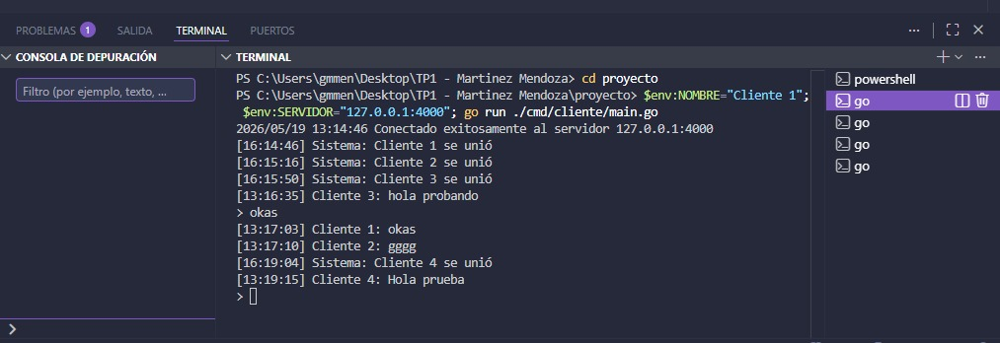
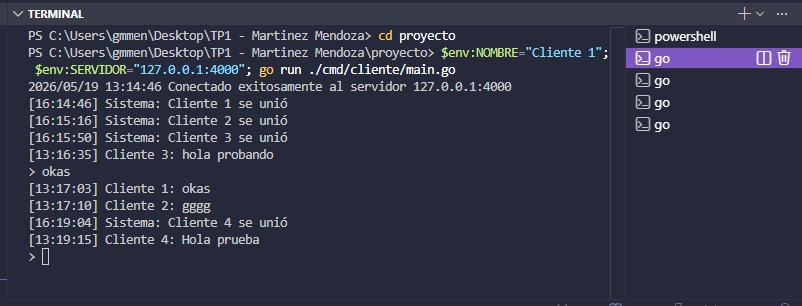

# Servidor de Broadcast Concurrente

Proyecto base para la Clase sobre Sockets de Sistemas Distribuidos.

## Integrantes

- Martinez, Lazaro Ezequiel
- Mendoza, Guadalupe Maira


## Ejecución

### Local

```bash
# Terminal 1: servidor
go run ./cmd/servidor

# Terminal 2: cliente
go run ./cmd/cliente
```

### Docker Compose

```bash
docker-compose up --build
```

## Requisitos completados

- [X] Servidor TCP concurrente
- [X] Protocolo JSON
- [X] Registro de clientes con sync.RWMutex
- [X] Broadcast a todos los clientes
- [X] Cliente interactivo (stdin + recepción paralela)
- [X] Docker + docker-compose
- [ ] Bonus: descubrimiento UDP

## Captura de ejecución

A continuación se muestran las capturas de pantalla que demuestran el funcionamiento del servidor de broadcast concurrente con múltiples clientes conectados en paralelo:

### Conexión y envío de mensajes


### Broadcast de mensajes en tiempo real


